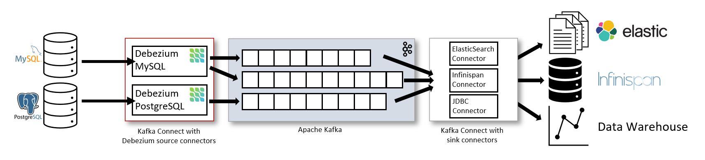
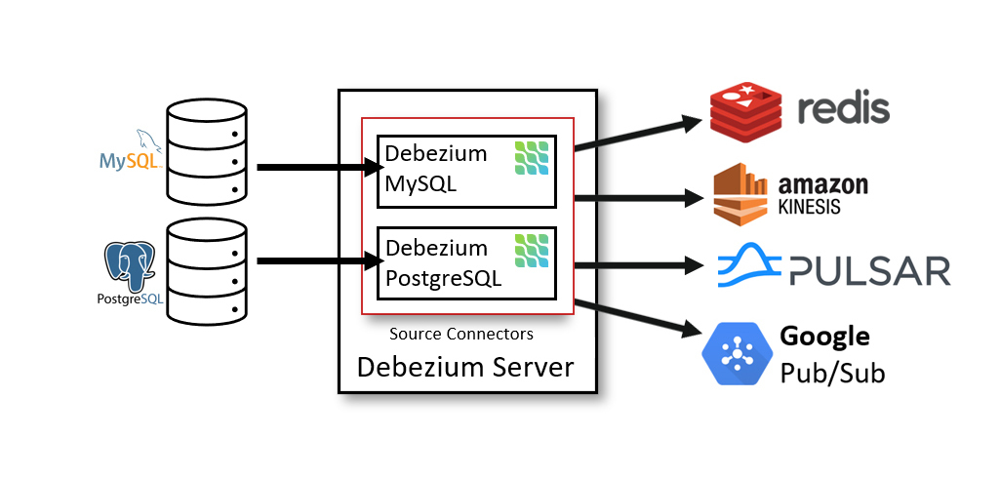

# Debezium1.9 单机部署

Debezium 是一个CDC工具，将数据源通过分布式平台将数据库的变化通过的流的方式实时追踪变化。

## Debezium 三种方式

### Debezium

通过[Apache Kafka Connect](https://kafka.apache.org/documentation/#connect) 框架，通过插件进行操作.


- source connectors 将数据变化计入到kafka
    - mysql 通过binlog
    - postgresql 通过 a logical replication stream
- sink connectors 则更具kafka topic 记录的操作，推送同步到其他数据库平台(sink的处理flink cdc, spark等等)

### Debezium Server


是一个可以通过REST API 方式进行source database 配置的服务， 输出的平台通常是redis, amazon, plusar, google pub/sub.

### Embedded Engine 内嵌引擎

将jar添加到你自己的微服务项目中

```xml

<dependencies>
    <dependency>
        <groupId>io.debezium</groupId>
        <artifactId>debezium-embedded</artifactId>
        <version>${version.debezium}</version>
    </dependency>
    <dependency>
        <groupId>io.debezium</groupId>
        <artifactId>debezium-connector-mysql</artifactId>
        <version>${version.debezium}</version>
    </dependency>
    <dependency>
        <groupId>io.debezium</groupId>
        <artifactId>debezium-connector-mongodb</artifactId>
        <version>${version.debezium}</version>
    </dependency>
</dependencies>
```

## Example for MS SQL Server

### 安装配置Zookeeper, Apache Kafka

#### 配置 Kafka Connect

##### 安装插件

The connector plug-ins are available from Maven:
MySQL Connector plugin archive

    Postgres Connector plugin archive

    MongoDB Connector plugin archive

    SQL Server Connector plugin archive

    Oracle Connector plugin archive

    Db2 Connector plugin archive

    Cassandra 3.x plugin archive (incubating)

    Cassandra 4.x plugin archive (incubating)

    Vitess plugin archive (incubating)

下载后，将目录复制到plugin的path下，你可以自行定义，配置在`connect-standalone.properties`文件中。

其次你需要设置一个connectors的properties
```sql
name=execution_source_mssql_19.199
connector.class=io.debezium.connector.sqlserver.SqlServerConnector
database.hostname=db_host
database.names=database_name
database.port=2433
database.user=irsdba
database.password=db_password
database.server.id=184054
database.server.name=fullfillment
database.include.list=inventory
database.history.kafka.bootstrap.servers=127.0.0.1:9092 
database.history.kafka.topic=dbhistory.fullfillment
include.schema.changes=true
```
#### 启动kafka
`./bin/kafka-server-start.sh ./config/server.properties`
`./bin/connect-standalone.sh /data/kafka/config/connect-distributed.properties  /data/kafka/config/其次你需要设置一个connectors的properties.properties`
### 开启SQL Server的CDC功能

#### Procedure

* From the View menu in SQL Server Management Studio, click Template Explorer.
* In the Template Browser, expand SQL Server Templates.
* Expand Change Data Capture > Configuration, and then click Enable Table Specifying Filegroup Option.
* In the template, replace the table name in the USE statement with the name of the table that you want to capture.
* Run the stored procedure sys.sp_cdc_enable_table.

```sql
USE MyDB GO
EXEC sys.sp_cdc_enable_table
@source_schema = N'dbo',
@source_name   = N'MyTable', 
@role_name     = N'MyRole',  
@filegroup_name = N'MyDB_CT',
@supports_net_changes = 0
GO
```
修改表
```sql 
ALTER DATABASE MyDatabaseName SET CHANGE_TRACKING = ON;
```

其中要查看filegroup_name, 则需要：

```sql
USE WideWorldImporters;
SELECT FILEGROUP_NAME(1) AS Result;
```
查看设置情况
```sql 
SELECT s.name AS Schema_Name, tb.name AS Table_Name , tb.object_id, tb.type, tb.type_desc,
 tb.is_tracked_by_cdc FROM sys.tables tb INNER JOIN sys.schemas s on s.schema_id = tb.schema_id 
 WHERE tb.is_tracked_by_cdc = 1
 ```
查看当前数据库
```sql
SELECT *  FROM sys.change_tracking_databases  WHERE database_id=DB_ID();
```